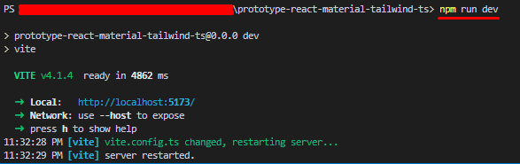

# Netzero

## Live Demo

## Environment

- `Node.js v18.12.1`

## Stack

- **Framework:** `React.js v18.2.0`
- **Theme:** `Material-Tailwind v1.4.2`

## How to run the project.

1. Open the terminal window in the root directory.
2. Run command `npm run dev` in it.

3. You can see a live website like the above screenshot.
[http://localhost:3000](http://localhost:3000)
